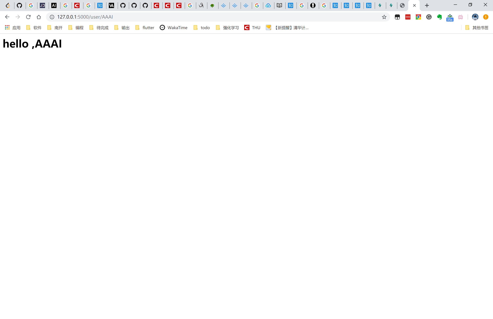

@[toc]
# 《Flask Web开发》读书笔记(一)
## 第一部分 Flask简介
### 1.安装
Flask有两个主要依赖：
1. 路由、调试和Web服务器网关接口（Web Server Gateway Interface,WSGI）子系统由Werkzeug提供
2. 模版系统由Jinja2提供

### 2.程序的基本结构
#### 2.1 初始化
所有Flask程序都必须创建一个程序实例。Web服务器使用一种名为Web服务器网关接口（WSGI）协议，把接受自客户端的所有请求都转交给这个对象处理。程序实例是Flask类的对象，用以下代码创建：
```python
from flask import Flask
app=Flask(__name__)

```
Flask类的构造函数只有一个必须指定的参数，即程序主模块或包的名字。在大多数程序中，python的`__name__`变量就是所需的值。
#### 2.2 路由和视图函数
##### 路由
客户端（如Web浏览器）把请求发送给Web服务器，Web服务器再把请求发送给Flask程序实例。程序实例需要知道对每个URL请求运行那些代码，所以保存一个URL到python函数的映射关系。处理URL和函数之间的程序叫做**路由**。

在Flask程序中，定义路由最简便的方式，是使用程序实例提供的`app.route`修饰器，把修饰的函数注册为路由。

下面的例子说明了如何使用`app.route`声明路由：
```python
@app.route('/')
def index():
    return '<h1>Hello</h1>'

```

上面把`index()`函数注册为程序根地址的处理程序。如果部署程序服务器域名为`www.example.com`，在浏览器中访问`http://www.example.com`后，会触发服务器执行`index()`函数。此函数的返回值叫做**响应**，是客户端接受到的内容。如果客户端是Web浏览器，响应就是显示给用户查看的文档。

像`index()`这样的函数称为**视图函数（view function）**。视图函数返回的响应可以是包含HTML的简单字符串,也可以是复杂的表单。

#### 2.3 启动服务器

程序实例用`run`方法启动Flask集成的开发Web服务器：
```python
if __name__=='__main__':
    # 这里启用的是调试模式，debug参数为True
    app.run(debug==True)
```
#### 2.4 一个完整的程序

**示例2.1**一个完整的Flask程序
```python
from flask import Flask
app=Flask(__name__)

@app.route('/')
def index():
    return '<h1>Hello</h1>'

if __name__=='__main__':
    app.run(debug=True)

```

上面这段代码的含义：

1. 首先，代码导入了 Flask 类。这个类的实例将会是我们的 WSGI 应用程序。
   
2. 接下来，使用`Flask`创建一个该类的实例，第一个参数是应用模块或者包的名称。 如果使用单一的模块（如本例），你应该使用 `__name__` ，因为模块的名称将会因其作为单独应用启动还是作为模块导入而有不同（ 也即是 `'__main__' `或实际的导入名）。这是必须的，这样 Flask 才知道到哪去找模板、静态文件等等。


3. 然后，使用 route() 装饰器告诉 Flask 什么样的URL 能触发我们的函数。
这个函数的名字也在生成 URL 时被特定的函数采用，这个函数返回我们想要显示在用户浏览器中的信息。

4. 最后用 run() 函数来让应用运行在本地服务器上。 其中` if __name__ == '__main__':` 确保服务器只会在该脚本被 Python 解释器直接执行的时候才会运行，而不是作为模块导入的时候。

示例2-2是上面程序的增强版，添加了一个动态路由，访问这个地址时，会看到针对个人的欢迎信息

**示例2-2**包含动态路由的Flask程序
```python
from flask import Flask
app=Flask(__name__)

@app.route('/')
def index():
    return '<h1>Hello</h1>'

@app.route('/user/<name>')
def user(name)；
    return '<h1>Hello,%s!</h1>'% name

if __name__ == '__main__':
    app.run(debug=True)
```

**注意**：再测试动态路由前，要确保服务器正在运行，然后访问`http://127.0.0.1:5000/user/Turing`
程序会显示一个使用name动态参数生成的欢迎信息。

#### 2.5 请求-响应循环
##### 2.5.1 程序和请求上下文
`Flask`从客户端收到请求时，需要让视图函数访问一些对象，这样才能够处理请求。但是要视图函数访问请求对象，就需要将这些对象作为参数传入视图函数，这样的话，每个视图函数的参数将会变得很多。

为了避免这种情况，`Flask`使用上下文临时把某些对象变成了全局访问，例如
```python
from flask import request

@app.route('/')
def index():
    user_agent = request.headers.get('User-Agent')
    return '<p>You browser is %s</p>' %user_agent
```
```
You browser is Mozilla/5.0 (Windows NT 10.0; Win64; x64) AppleWebKit/537.36 (KHTML, like Gecko) Chrome/75.0.3770.100 Safari/537.36
```
上面例子中，在视图函数`index()`中把`request`作为了全局变量。事实上，`request`不可能是全局变量，例如在多线程服务器上，多个线程同时处理不同客户端发送的不同请求，每个线程对应的request对象必然不同。`Flask`使用上下文使得特定的变量在一个线程中全局可访问，却不会干扰其他线程。

*注：线程是可单独管理的最小指令集。进程经常使用多个活动线程，有时还会共享内存或文件字柄等资源。多线程Web服务器会创建一个线程池，再从线程池中选择一个线程用于处理接收到的请求。*

`Flask`中有两种上下文：程序上下文和请求上下文

|  变量名        | 上下文  | 说明 |
|  ----          |  ----  | ----  |
| `current_app`  | 程序上下文 | 当前激活程序的程序实例  |
| `g`            | 程序上下文 | 处理请求时用作临时存储的对象，每次请求都会重设这个变量    |
| `request`      | 请求上下文 | 请求对象，封装了客户端发出的http请求中的内容   |
| `session`      | 请求上下文 | 用户会话，用于存储请求之间需要“记住”的值的词典   |

在分发请求之前，`flask`会激活程序和请求上下文，请求处理之后再将其删除。程序上下文被激活后，就可以在线程中使用`current_app`和`g`变量。请求上下文也是如此。如果没有激活就使用，就会导致错误。例如：
```python
>>> from hello import app
>>> from flask import current_app
>>> current_app.name
Traceback (most recent call last): ... RuntimeError: working outside of application context
>>> app_ctx = app.app_context() 
>>> app_ctx.push() 
>>> current_app.name 
'hello' 
>>> app_ctx.pop()
```
在此例中，没激活程序上下文之前就调用`current_app.name`会导致错误，但激活后就没有问题了，在程序实例上调用`app.app_context()`能够获得一个程序的上下文。
##### 2.5.2 请求调度
程序接收到客户端的请求之后，需要找到处理该请求的视图函数。此时，`Flask`会在程序的`URL`映射（`URL`映射是`URL`和视图函数之间的对应关系）中查找请求的`URL`。`Flask`使用`app.route`修饰器或非修饰器形式的`app.add_url_rule()`生成映射。
```python
>>> from hello import app 
>>> app.url_map 
Map([<Rule '/' (HEAD, OPTIONS, GET) -> index>,  
<Rule '/static/<filename>' (HEAD, OPTIONS, GET) -> static>,  
<Rule '/user/<name>' (HEAD, OPTIONS, GET) -> user>])
```

`/` 和` /user/<name> `路由在程序中使用 `app.route`修饰器定义。`/static/<filename> `路由是 `Flask`添加的特殊路由，用于访问静态文件。

`URL`映射中的`HEAD`、`Options`、`GET`是请求方法，由路由进行处理。`Flask`为每个路由都指定了请求方法，这样不同的请求方法发送到相同的`URL`上时，会使用不同的视图函数进行处理。`HEAD`和`OPTIONS`方法由 `Flask`自动处理，因此可以这么说，在这个程序中`URL`映射中的 3 个路由都使用 GET 方法。

##### 2.5.4 响应

`flask`调用视图函数之后，会将其返回值作为响应的内容。一般来说，响应就是一个简单的字符串，作为`html`页面回送客户端。

但`http`协议需要的不仅仅是作为请求响应的字符。而是状态码，在`flask`中默认200，这表明请求已经成功被处理了。

如果视图函数返回的响应需要不同的状态码，那么可以把状态码作为第二个返回值，添加到响应文本之后，例如：
```python
@app.route('/')
def index():
    return '<h1>Bad request</h1>', 400
```
上面的视图函数返回了400，表示请求无效。

视图函数返回的响应还可以接受第三个参数，这是一个由`headers`返回的字典，可以添加到http响应中。一般情况下不需要这么去做。

如果不想返回由1个、2个或3个值组成的元组，Flask视图函数还可以返回`Responce`对象。`make_responce()`函数可以接受1个、2个或3个参数，并返回一个`response`对象，有时需要在视图函数中进行这种转换，然后在响应对象上调用调用各种方法，进一步设置响应。下例创建了一个响应对象，然后设置了`cookie`：

```python
from flask import make_response

@app.route('/')
def index():
    response = make_response('<h1>This document carries a cookie!</h1>')
    response.set_cookie('answer','42')
    return response
```