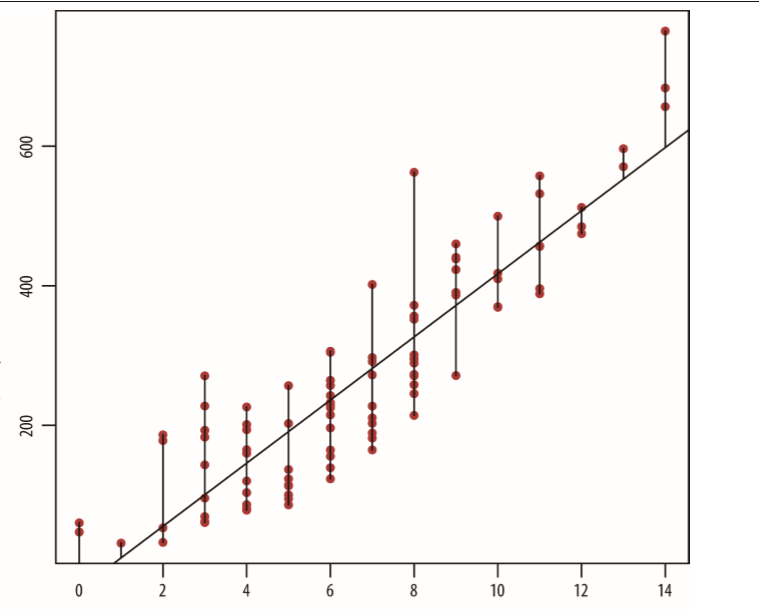
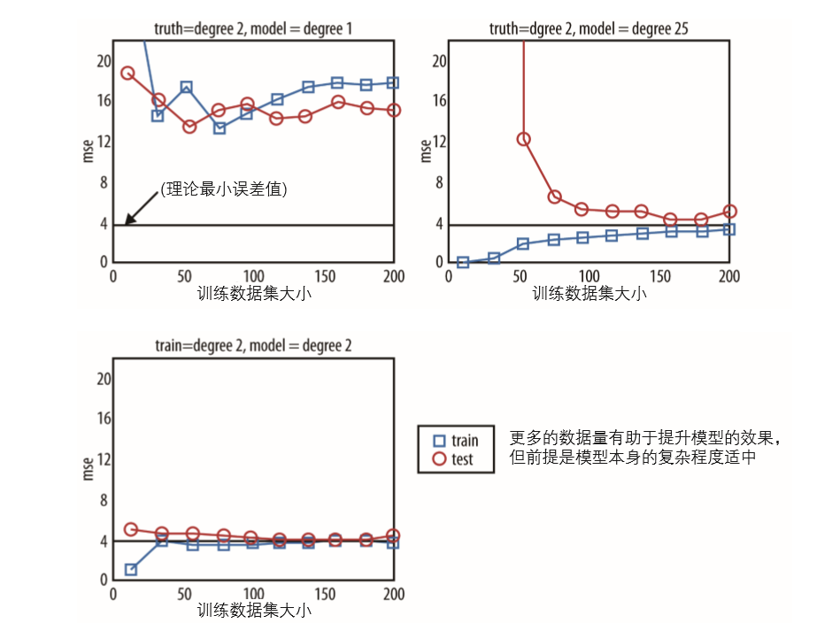

[toc]
#第三章 算法
数据科学里必须要了解的算法：
1. 数据清理和预处理的算法（数据过程）。比如排序、MapReduce、Pregel
2. 用于参数估计的最优化算法。比如随即梯度下降(Stochastic Gradient Descent)、牛顿法、最小二乘法。
3. 机器学习算法
   

## 3.1机器学习算法
机器学习算法的应用主要有三个方面：预测、分类和聚类
## 3.2 三大基本算法
### 3.2.1 线性回归模型
从根本上来说，想表示两个变量之间的数学关系时，就可以使用线性回归。使用线性回归时，首先要假设输出变量（因变量，标签）和预测变量（自变量，特征）之间存在线性关系。（多元线性回归，一个输出变量和多个预测变量之间存在关系）

理解线性回归的一个切入点是先确定那条直线。假设两个变量之间的关系是线性的，因此模型的形式可以表示为：
$$y=\beta_0+\beta_1x$$
接下来就是在给定数据样本$(x_1,y_1)$,$(x_2,y_2)$,...,$(x_n,y_n)$的情况下，确定最佳的截距($\beta_0$)和斜率($\beta_1$)的估计值。

线性模型也可以用矩阵来表示：
$$y=x*\beta$$
其中$x$是数据矩阵，$\beta$是参数向量。任务就是找一条最佳的直线（参数向量估计值）拟合数据。

#### 模型拟合
参数向量如何估计？一个直观的想法是：如果存在一条最佳拟合的直线，那么所有样本数据点到这条直线的距离应该是所有直线中最小的。

如图，假设数据点的$y$值用$y_i$表示，其在直线上的拟合值（预测值）为$\hat y_i$，那么一个样本点与其拟合值的距离可以定义为两个点在$y$值上的 “离差平方”：$(y_i-\hat y_i)^2$。所有数据点的距离之和也称作“离差平方和”： $\sum(y_i-\hat y_i)^2$。最优的那条直线具有最小的“离差平方和” 。可以看出，这里距离的定义，也就是“离差平方和” 还可以解释为模型的预测误差。这样的估计方法就是著名的**最小二乘估计法**。\

离差平方表示为RSS(Residual Sum of Squares),可以表示为：
$$RSS(\beta)=\sum_i(y_i -\beta x_i)^2$$

$i$表示某个数据点。离差平方和是一个关于$\beta$的函数。为了找到最优的$\beta$，需要最小化离差平方和。

利用微积分，对$RSS(\beta)$针对$\beta$求导并令其为0即可找到可能的最优解$RSS(\beta)=(y-\beta x)^t(y-\beta x)$,可以得到：
$$\hat \beta=(x^tx)^{-1}x^ty$$
$\hat \beta$代表 $β$ 的估计值，真实的$β$是无从得知的。在得到$β$估计值的表达式之后，主要将观测数据的值代入即可计算出实际的估计值。

这样就可以求出模型最终的最优估计直线。

至于到底能否采纳这个线性模型，将它用于数据关系描述和结果预测，这取决于我们的判断。一个自然的问题是，对得到的预测值，我们有多大的自信认为它很接近真实值？

这在统计学上叫置信值的问题。因此，线性模型得到的预测值只是所有可能的预测值的一个总体趋势，而围绕这个趋势的波动性还没有被模型考虑进来。

#### 最小二乘模型的延伸
上面讨论的是一个简单的线性回归模型（一个输出变量，一个预测变量），模型参数的预测采用了最小二乘法来估计$β$。在此模型的基础上，我们可以从三个方面进行延伸：

1. 增添关于模型误差项的假设
2. 增添更多的预测变量
3. 对预测变量加以判断

##### 增添关于模型误差项的假设
如果只是应用线性模型预测给定$x$值情况下的$y$值，那么得到的预测值只是一个确定值这就忽视了预测必然存在的可变性。

对于一个给定$x$的预测情况，$y$的值是不定的。为了让模型捕捉数据中的不确定性，可以将模型的形式扩展为：
$$y=\beta_0+\beta_1x+\epsilon$$
其中$\epsilon$是模型中新加的项。也叫做“噪声”项，代表数据中不能被模型拟合的部分。它也称为误差项—— $\epsilon$代表模型的实际误差，也就是实际观测值与真实回归直线上所得值的误差。真实的回归直线永远是未知的。我们只能通过$\hat \beta$估计。

我们通常假设该残差服从一个均值为0，方差未知的正态分布，有：
$\epsilon$  ~ $N(0,\sigma^2)$

在误差项的正态分布假设下，我们可以从条件分布的角度解释线性回归模型。也就是说，对于给定的$x$,$y$的条件分布是一个正态分布：

$p(y|x)$ ~ $N(\beta_0+\beta_1x,\sigma^2)$

假设x=5，也就是说y服从一个正态分布，均值为$y=\beta_0+\beta_1*5$，方差为$\sigma^2$。其中$\beta_0$、$\beta_1$以及$\sigma^2$的值需要从数据里估计。

现在的问题是，如何拟合这个模型？如何估计这些参数？

其中$\beta_0$和$\beta_1$的估计方法是基于最小二乘法估计的。因此难题是如何估计$\sigma^2$。

基本的想法是用实际的观测误差，也叫残差，去估计实际误差。实际残差为：
$$e_i=y_i-\hat y_i=y_i-(\hat \beta_0+\hat \beta_1x_i),i=1,...,n$$
$\sigma^2$的无偏估计量为：
$$\frac{\sum_ie_i^2}{n-2}$$
**注：这里用n-2做分母而不是n，这个误差估计量是一个无偏估计量。n-2中的2是模型中参数的个数。**

上面的方差估计量也叫做均方误差(mean squared error)，它衡量的是预测值偏离实际观测值的程度。对预测问题来说，均方误差是被广泛使用的一个误差估计量。对回归问题来说，它可以作为一个方差估计量。

###### 模型评估标准
1. R方
$$R^2=1-\frac{\sum_i(y_i-\hat y_i)^2}{\sum (y_i-\breve y)^2}$$
这是R方的公式，可以理解为数据中能够被模型所解释的方差占数据总方差的比重。均方误差是分式的分子部分，分母对应的是数据中的总方差。

2. 交叉验证
这是另外一种评估模型的方法。遵循的程序如下：分割数据，80%用作训练数据集，20%用作测试。在训练数据集上拟合模型并估计模型的参数，并在测试数据集上计算出模型的均方误差，并与训练数据集上模型的均方误差进行对比。如果两种均方误差差距很小，那么模型具有不错的扩展性，其过拟合的风险较小。

##### 增加预测变量
之前讨论的是最简单的线性回归模型：一个自变量和一个应变量。在此模型的基础上，增加自变量的个数，从而得到多元回归模型：、
$$y=\beta_0+\beta_1x_1+\beta_2x_2+\beta_3x_3+\epsilon$$

之前的模型表达式在这里也同样适用，因为之前使用了矩阵表达式，增加一个变量无非在矩阵上增加了一列，模型的表达形式不发生改变。

在确定使用哪些预测变量之前，可以画出预测变量与每一个自变量之间的散点图，以及自变量之间的散点图，来确认可能有用的预测变量和每一个变量之间的交叉变动关系。选定预测变量之后，同简单的线性回归一样，依然可以用$R^2$和交叉验证的方法评价模型的质量。
##### 对预测变量加以变换
之前使用的是y与x之间的线性关系。现在可以使用x的高阶项，这样就变成了类似下式的多项式回归模型：
$$y=\beta_0+\beta_1x+\beta_2x^2+\beta_3x^3$$
多项式回归模型不是线性回归模型。但是我们可以把他们看作线性模型，前提是做一下适当的变换。例如，假设$z=x^2$,$w=x^3$，这样上面的模型就变成一个基于三个预测变量(x,z,w)的线性回归模型了。

### 3.2.2 k近邻模型(k-NN)
k近邻模型是一个分类算法，在给定一个做好分类的数据集后，k近邻可以学习其中的分类信息，并自动的给未来没有分好类的数据分类。

k近邻的主要思路是：根据属性值的相似度找到某个对象的相似对象们，并让其相似对象们一起“投票”决定该对象属于哪一类。如果有两个或者多个类别投票数相同，就从这些类别中随机挑选一个作为该对象的属性值。

k近邻需要解决两个问题：一是如何根据属性定义个体之间的相似度或紧密程度。二是如何才能确定一个最优的k值。

k近邻方法的步骤如下：

1. 确定相似性定义，通常也叫“距离”
2. 将数据分为训练集和测试集
3. 选择一个模型评价标准
4. 选择不同的k值，应用k近邻模型，看哪个模型效果最好
5. 基于选定的评价标准，选出最优的k值
6. 进行样本外测试

#### 相似性/距离测度
相似性测度的选择在很大程度取决于问题的背景和数据本身的特征，常用的距离测度有：欧几里得距离、余弦度、Jaccard距离、Mahalanobis距离、Hamming距离、Manhattan距离等

### 3.2.3 k均值算法
之前的算法都是有监督算法，而k均值算法是非监督算法。

假设有一个用户层面的观测数据，每个用户都可以表示成某些特征变量的组合，任务是根据用户变量信息的不同把用户分为几组。

聚类的整个过程主要分为四步;
1. 在数据空间中随机选择k个点，要尽量让中心点靠近数据点，而且各中心点之间要明显不同
2. 将数据点分类到离它最近的中心点
3. 重新计算中心点的位置
4. 重复上述两步直到中心点的位置不动或者几乎不动。