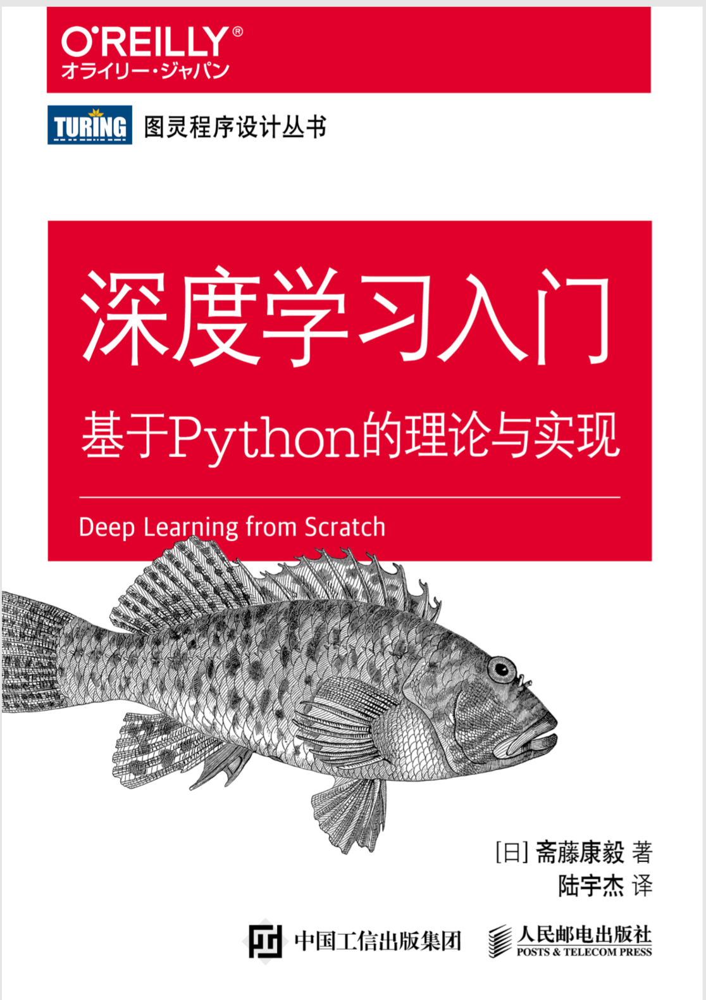
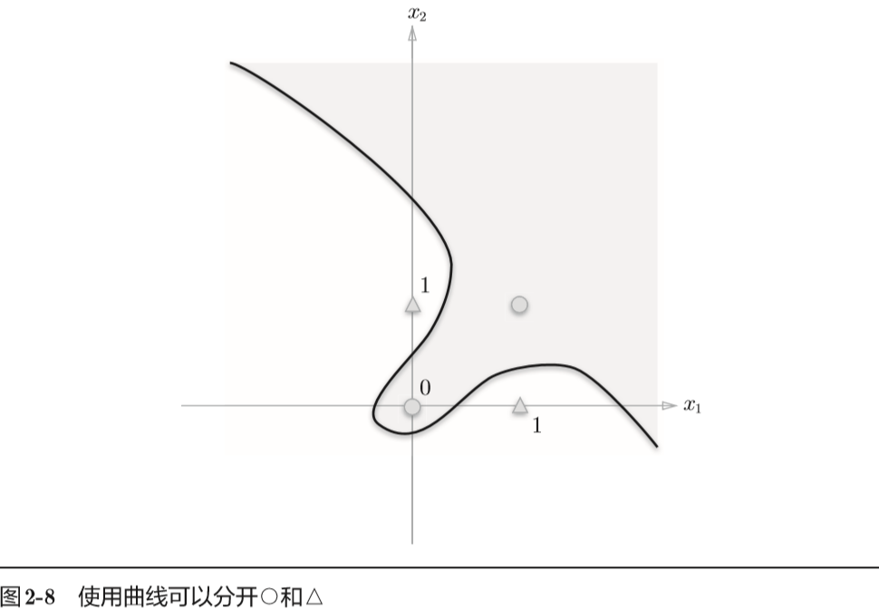

[toc]
# 深度学习入门-基于python的理论与实现(2)

## 第二章：感知器(perceptron)
### 2.1 感知器是什么
感知器接受多个输入信号，输出一个信号。

如图是一个接收两个输入信号的感知器。


$x_1$,$x_2$是输入信号，$y$是输出信号，$w_1$,$w_2$是权重。

图中的圆圈称为“神经元”（或“节点”）。输入信号被送往神经元时，会被分别乘以固定的权重($w_1x_1$,$w_2x_2$)。神经元会 计算传送过来信号的总和，只有当这个总和超过某个界限时，才会输出1。将这个界限称为**阈值**，用$\theta$表示。

就上述内容用数学公式表示：
$$y= \begin{cases}
0 & (w_1x_1+w_2x_2 \leq \theta )\\
1 & (w_1x_1+w_2x_2 > \theta )
\end{cases}$$

感知器的多个输入信号都有各自的权重，这些权重发挥控制各个信号的重要性的作用。也就是说，权重越大，对应该权重的信号的重要性越高。

### 2.2 简单的逻辑电路
#### 2.2.1 与门
与门(AND gate)有两个输入和一个输出。下图是与门的真值表：


下面用感知机来表示与门。需要做的就是确定能满足上图的真值表的$w_1$、$w_2$、$θ$的值。

那么，设定什么样的值才能制作出满足上图的条件的感知机呢？ 实际上，满足上图的条件的参数的选择方法有无数多个。比如，当
($w_1$,$w_2$, $θ$) = (0.5, 0.5, 0.7)时，可以满足上图的条件。此外，当($w_1$,$w_2$,$θ$) 为(0.5,0.5, 0.8)或者(1.0, 1.0, 1.0)时，同样也满足与门的条件。设定这样的参数后，仅当$x_1$和$x_2$同时为1时，信号的加权总和才会超过给定的阈值$θ$。

#### 2.2.2 与非门和或门
与非门(NAND gate)颠倒了与门的输出。真值表如下：
| $x_1$ | $x_2$ | $y$ |
| ------| ------| ----|
|   0   |   0   |  1  |
|   1   |   0   |  1  |
|   0   |   1   |  1  |
|   1   |   1   |  0  |

只要把实现与门的参数值的符号取反， 就可以实现与非门。

或门是**只要有一个输入信号是1，输 出就为1**的逻辑电路。真值表如下：
| $x_1$ | $x_2$ | $y$ |
| ------| ------| ----|
|   0   |   0   |  0  |
|   1   |   0   |  1  |
|   0   |   1   |  1  |
|   1   |   1   |  1  |

如上所示，我们已经知道使用感知机可以表示与门、与非门、或门的逻辑电路。重要的一点是：**与门、与非门、或门的感知机构造是一样的**。 实际上，3个门电路只有参数的值（权重和阈值）不同。也就是说，相同构造的感知机，只需通过适当地调整参数的值，就可以变身为与门、与非门、或门。

### 2.3 感知器的实现
#### 2.3.1 简单的实现
现在，我们用Python来实现刚才的逻辑电路。这里，先定义一个接收参数x1和x2的AND函数。
```python
def AND(x1,x2):
    w1,w2,theta=0.5,0.5,0.7
    tmp=x1*w1+x2*w2
    if tmp <= theta:
        return 0
    elif tmp > theta:
        return 1

```
在函数内初始化参数w1、w2、theta，当输入的加权总和超过阈值时返回1， 否则返回0。我们可以确认一下输出结果是否真值表所示：
```
AND(0, 0) # 输出0 
AND(1, 0) # 输出0 
AND(0, 1) # 输出0 
AND(1, 1) # 输出1
```

这样就实现了与门。按照同样的步骤，也可以实现与非门和或门，不过对它们的实现稍作修改。

#### 2.3.2 导入权重和偏置

刚才的与门的实现比较直接、容易理解，但是考虑到以后的事情，我们将其修改为另外一种实现形式。

在此之前，首先把之前2.1的式子的$θ$换成$−b$，于是就可以用下面的式子来表示感知机的行为：
$$y= \begin{cases}
0 & (b+w_1x_1+w_2x_2 \leq 0 )\\
1 & (b+w_1x_1+w_2x_2 > 0 )
\end{cases}$$

2.1的式子和上面的式子虽然有一个符号不同，但表达的内容是完全相同的。此处，$b$称为偏置，$w_1$和$w_2$称为权重。

如上式所示，感知机会计算输入信号和权重的乘积，然后加上偏置，如果这个值大于0则输出1，否则输出0。 

下面，我们使用NumPy，按上式的方式实现感知机。在这个过程中，我们用Python的解释器逐一确认结果。
```python
>>> import numpy as np 
# 输入 
>>> x = np.array([0, 1])
# 权重     
>>> w = np.array([0.5, 0.5])
 # 偏置  
>>> b = -0.7                 
>>> w*x 
array([ 0. ,  0.5]) 
>>> np.sum(w*x) 
0.5 
>>> np.sum(w*x) + b 
-0.19999999999999996   
# 大约为-0.2（由浮点小数造成的运算误差）

```
如上例所示，在NumPy数组的乘法运算中，当两个数组的元素个数相同时， 各个元素分别相乘，因此$w*x$的结果就是它们的各个元素分别相乘（[0, 1] * [0.5, 0.5] => [0, 0.5]）。之后，np.sum(w*x)再计算相乘后的各个元素的总和。 最后再把偏置加到这个加权总和上，就完成了上式的计算。

#### 2.3.3 使用权重和偏置的实现
使用权重和偏置，可以像下面这样实现与门。
```python
def AND(x1, x2):    
    x = np.array([x1, x2])    
    w = np.array([0.5, 0.5])    
    b = -0.7    
    tmp = np.sum(w*x) + b    
    if tmp <= 0:       
        return 0    
    else:       
        return 1

```
这里把$−θ$命名为偏置$b$，但是注意，**偏置和权重$w_1$、$w_2$的作用是不一样的**。

具体地说，**$w_1$和$w_2$是控制输入信号的重要性的参数，而偏置是调整神经元被激活的容易程度（输出信号为1的程度）的参数**。
比如，若b为−0.1，则只要输入信号的加权总和超过0.1，神经元就会被激活。但是如果b 为−20.0，则输入信号的加权总和必须超过20.0，神经元才会被激活。像这样，偏置的值决定了神经元被激活的容易程度。另外，这里我们将$w_1$和$w_2$称为权重， 将b称为偏置，但是根据上下文，有时也会将b、$w_1$、$w_2$这些参数统称为权重。

下面是与非门与或门的实现：
```python
def NAND(x1n,x2):
    x=np.array([x1n,x2])
    # 权重与偏置与AND不同
    w=np.array([-0.5,-0.5])
    b=0.7
    tmp=np.sum(w*x)+b
    if tmp<=0:
        return 0
    else:
        return 1


def OR(x1,x2):
    x=np.array([x1,x2])
    w=np.array([0.5,0.5])
    b=-0.2
    tmp=np.sum(w*x)+b
    if tmp<=0:
        return 0
    else:
        return 1

```

### 2.4 感知器的局限性
#### 2.4.1 异或门
异或的真值表如下：

| $x_1$ | $x_2$ | $y$ |
| ------| ------| ----|
|   0   |   0   |  0  |
|   1   |   0   |  1  |
|   0   |   1   |  1  |
|   1   |   1   |  0  |

仅当$x_1$或$x_2$中的一方为1时你，才会输出1。要用感知机实现这个异或门，应该设定什么样的权重参数呢？

实际上，用前面介绍的感知器是无法实现这个异或门的。为什么用感知器可以实现与门、或门，却无法实现异或门呢？下面我们尝试通过画图来思考其中的原因。 首先，我们试着将或门的动作形象化。或门的情况下，当权重参数(b, $w_1$,$w_2$) = (−0.5, 1.0, 1.0)时，可满足或门的真值表条件。此时，感知器可用下面的式表示：
$$y= \begin{cases}
0 & (-0.5+x_1+x_2 \leq 0 )\\
1 & (-0.5+x_1+x_2 > 0 )
\end{cases}$$

上式表示的感知器会生成由直线−0.5 + x1 + x2 = 0分割开的两个空间。其中一个空间输出1，另一个空间输出0，如图所示：


或门在(x1,x2) = (0, 0)时输出0，在(x1,x2)为(0,1)、(1,0)、(1,1)时输出1。上图中，○表示0，△表示1。如果想制作或门，需要用直线将图中的○和△分开。实际上，刚才的那条直线就将这4个点正确地分开了。 

那么，换成异或门的话会如何呢？能否像或门那样，用一条直线作出分割下面图中的○和△的空间呢？


可以发现，想要用一条直线将图中的○和△分开，无论如何都做不到。事实上， 用一条直线是无法将○和△分开的。

#### 2.4.2 线性和非线性

上面图中的○和△无法用一条直线分开，但是如果将“直线”这个限制条件去掉，就可以实现了。

比如，我们可以像下图那样，作出分开○和△的空间。 


感知器的局限性就在于它只能表示由一条直线分割的空间。上图这样弯曲的曲线无法用感知机表示。另外，由上图这样的曲线分割而成的空间称为**非线性空间**，由直线分割而成的空间称为**线性空间**。

### 2.5 多层感知器
感知机不能表示异或门让人深感遗憾，但也无需悲观。实际上，感知机的绝妙之处在于它可以“叠加”。
#### 2.5.1 已有门电路的组合
异或门可以通过下图所示的配置来实现。这里，x1和x2表示输入信号， y表示输出信号。x1和x2是与非门和或门的输入，而与非门和或门的输出则是与门的输入。


现在，我们来确认一下上图的配置是否真正实现了异或门。这里，把 s1作为与非门的输出，把s2作为或门的输出，填入真值表中。结果如图所示，观察x1、x2、y，可以发现确实符合异或门的输出。


#### 2.5.2 异或门的实现
根据上面的配置，可以来实现异或：
```python
def XOR(x1,x2):
    s1=NAND(x1,x2)
    s2=OR(x1,x2)
    y=AND(s1,s2)
    return y
```
这个异或函数会输出预期的结果：
```
XOR(0, 0) # 输出0 
XOR(1, 0) # 输出1 
XOR(0, 1) # 输出1 
XOR(1, 1) # 输出0

```
这样，异或门的实现就完成了。下面我们试着用感知机的表示方法（明确地显示神经元）来表示这个异或门，结果如图所示


如图所示，异或门是一种多层结构的神经网络。这里，将最左边的 一列称为第0层，中间的一列称为第1层，最右边的一列称为第2层。 

上图所示的感知机与前面介绍的与门、或门的感知机形状不同。实际上，与门、或门是单层感知机，而异或门是2层感知机。叠加了多 层的感知机也称为多层感知机（multi-layered perceptron）。

在上图所示的2层感知机中，先在第0层和第1层的神经元之间进行 信号的传送和接收，然后在第1层和第2层之间进行信号的传送和接收，具体如下所示。
1. 第0层的两个神经元接收输入信号，并将信号发送至第1层的神经元。 
2. 第1层的神经元将信号发送至第2层的神经元，第2层的神经元输出y。
   
 像这样，在异或门的感知机中，通过这样的结构（2层结构），感知机得以实现异或门。这可以解释为“单层感知机 无法表示的东西，通过增加一层就可以解决”。也就是说，通过叠加层（加深层），感知机能进行更加灵活的表示。