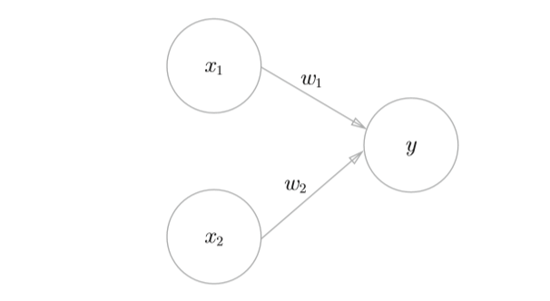
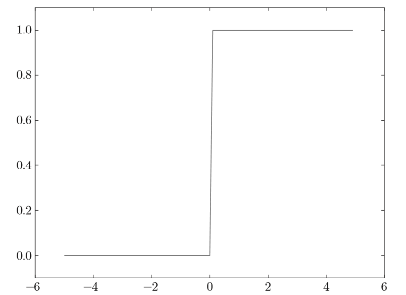
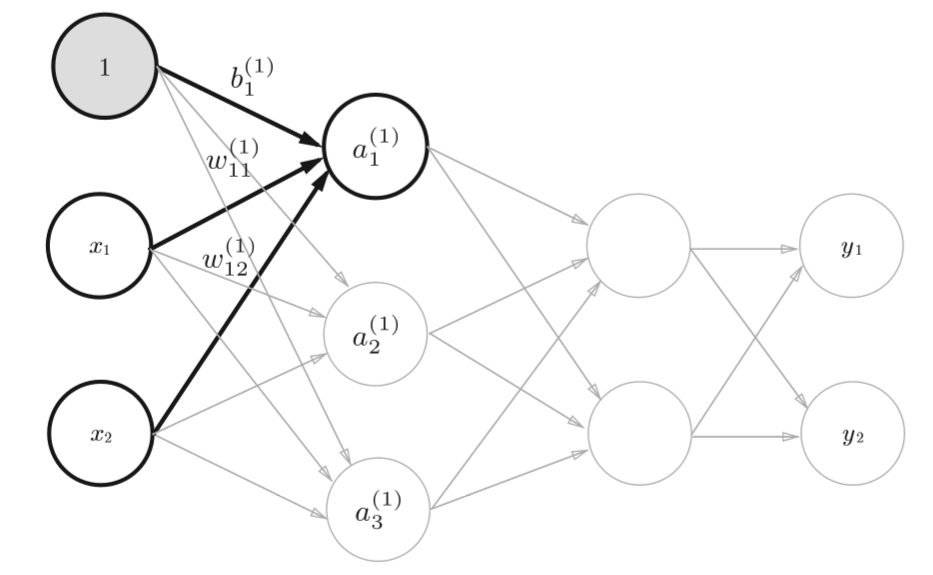
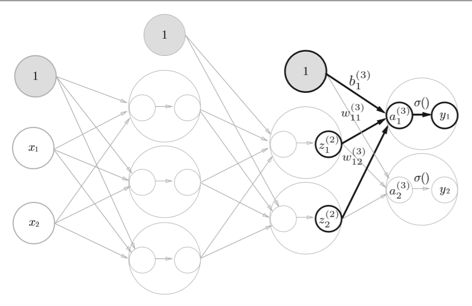

[toc]
# 深度学习入门-基于python的理论与实现(3)

## 第三章：神经网络
上一章学习了感知机。关于感知机，既有好消息，也有坏消息。好消息是，即便对于复杂的函数，感知机也隐含着能够表示它的可能性。即便是计算机进行的复杂处理，感知机（理论上）也可以将其表示出来。坏消息是，设定权重的工作，即确定合适的、能符合预期的输入与输出的权重，现在还是由人工进行的。

上一章中，我们结合与门、或门的真值表人工决定了合适的权重。神经网络的出现就是为了解决刚才的坏消息。具体地讲，**神经网络的一个重要性质是它可以自动地从数据中学习到合适的权重参数**。
### 3.1 从感知器到神经网络
#### 3.1.1 神经网络的例子
如图是一个神经网络：


如图所示。我们把最左边的一列称为**输入层**，最右边的一列称为**输出层**，中间的一列称为**中间层**。中间层有时也称为**隐藏层**。“隐藏”一词的意思是，隐藏层的神经元（和输入层、输出 层不同）肉眼看不见。

另外，这里把输入层到输出层依次称为第0层、第1层、第2层（层号之所以从0开始，是为了方便后面基于Python进行实现）。 图中，第0层对应输入层，第1层对应中间层，第2层对应输出层。

#### 3.1.2 复习感知器

如图的感知器接受$x_1$和$x_2$两个输入信号你，输出$y$。其数学公式如下：
$$y= \begin{cases}
0 & (b+w_1x_1+w_2x_2 \leq 0 )\\
1 & (b+w_1x_1+w_2x_2 > 0 )
\end{cases}$$

b是被称为偏置的参数，用于控制神经元被激活的容易程度；而$w_1$和$w_2$ 是表示各个信号的权重的参数，用于控制各个信号的重要性。 

在上图的网络中，偏置b并没有被画出来。如果要明确地表示出b，可以像下图这样做。


图中添加了权重为b的输入信号1。这个感知机将$x_1$、$x_2$、1三个信号作为神经元的输入，将其和各自的权重相乘后，传送至下一个神经元。在下一个神经元中，计算这些加权信号的总和。如果这个总和超过0，则输出1，否则输出0。

另外，由于偏置的输入信号一直是1， 所以为了区别于其他神经元，我们在图中把这个神经元整个涂成灰色。 

现在将上式改写成更加简洁的形式。为了简化上式，我们用一个函数来表示这种分情况的动作（超过0则输出1，否则输出0）。引入新函数 h(x)，将上式改写成下面的式子：
$$y=h(b+w_1x_1+w_2x_2)$$

$$h(x)= \begin{cases}
0 & (x \leq 0 )\\
1 & (x > 0 )
\end{cases}$$

第一个式中，输入信号的总和会被函数$h(x)$转换，转换后的值就是输出$y$。 然后第二个式所表示的函数$h(x)$，在输入超过0时返回1，否则返回0。因此， 第一个式子和第二个式子还有上面的式子做的是相同的事情。
#### 3.1.3 激活函数登场
刚才的$h(x)$函数会将输入信号的总和转换为输出信号，这种函数 一般称为激活函数（activation function）。如“激活”一词所示，激活函数的作用在于决定如何来激活输入信号的总和。 

### 3.2 激活函数
上一节表示的激活函数以阈值为界，一旦输入超过阈值，就切换输出。这样的函数称为“阶跃函数”。因此，可以说感知机中使用了阶跃函数作为 激活函数。也就是说，在激活函数的众多候选函数中，感知机使用了阶跃函数。 那么，如果感知机使用其他函数作为激活函数的话会怎么样呢？实际上，如果将激活函数从阶跃函数换成其他函数，就可以进入神经网络的世界了。下面就来介绍一下神经网络使用的激活函数。

#### 3.1 sigmoid函数
sigmoid函数：
$$h(x)=\frac{1}{1+e^{-x}}$$
神经网络中用sigmoid函数作为激活函数，进行信号的转换，转换后的信号被传送给下一个神经元。
#### 3.2.2 阶跃函数的实现

阶跃函数如下式：
$$h(x)= \begin{cases}
0 & (x \leq 0 )\\
1 & (x > 0 )
\end{cases}$$
当输入超过0时，输出1，否则输出0。可以像下面这样简单地实现阶跃函数。
```python
def step_function(x):
    if x>0:
        return 1
    else:
        return 0

```
这个实现简单、易于理解，但是参数x只能接受实数（浮点数）。也就是说，允许形如step_function(3.0)的调用，但不允许参数取NumPy数组，例如step_function(np.array([1.0, 2.0]))。为了便于后面的操作，我们把它修改为支持NumPy数组的实现。为此，可以考虑下述实现。
```python
def step_function(x):
    y=x>0
    return y.astype(np.int)

```
可以用astype()方法转换NumPy数组的类型。astype()方法通过参数指定期望的类型，这个例子中是np.int型。Python中将布尔型转换为int型后，True会转换为1n,False会转换为0。

#### 3.2.3 阶跃函数的图形

下面用图来表示上面定义的阶跃函数，为此需要使用matplotlib库。
```python
import numpy as np 
import matplotlib.pylab as plt
def step_function(x):    
    return np.array(x > 0, dtype=np.int)

x = np.arange(-5.0, 5.0, 0.1)
y = step_function(x) 
plt.plot(x, y)
plt.ylim(-0.1, 1.1) # 指定y轴的范围 
plt.show()
```    
np.arange(-5.0, 5.0, 0.1)在−5.0到5.0的范围内，以0.1为单位，生成 NumPy数组（[-5.0, -4.9, ..., 4.9]）。 step_function()以该NumPy数组为 参数，对数组的各个元素执行阶跃函数运算，并以数组形式返回运算结果。 对数组x、y进行绘图，结果如图所示。


如图，阶跃函数以0为界，输出从0切换为1（或者从1切换为0）。 它的值呈阶梯式变化，所以称为阶跃函数。

#### 3.2.4 sigmoid函数的实现
```python
def sigmoid(x):
    return 1/(1+np.exp(-x))
```
绘制sigmoid函数的图像:
```python
x = np.arange(-5.0, 5.0, 0.1) 
y = sigmoid(x) 
plt.plot(x, y) 
plt.ylim(-0.1, 1.1) # 指定y轴的范围 
plt.show()
```
这样就得到sigmoid函数的图像：


#### 3.2.5 sigmoid函数和阶跃函数的比较

如图是sigmoid函数和阶跃函数的对比。首先发现是“平滑性”的不同。sigmoid函数是一条平滑的曲线，输出随着输入发生连续性的变化。而阶跃函数以0为界，输出发 生急剧性的变化。sigmoid函数的平滑性对神经网络的学习具有重要意义。

另一个不同点是，相对于阶跃函数只能返回0或1，sigmoid函数可以返 回0.731 ...、0.880 ...等实数（这一点和刚才的平滑性有关）。也就是说，感知机中神经元之间流动的是0或1的二元信号，而神经网络中流动的是连续 的实数值信号。

阶跃函数和sigmoid函数虽然在平滑性上有差异，但是如果从宏观视角看图，可以发现它们具有相似的形状。实际上，两者的结构均是“输入小时，输出接近0（为0）； 随着输入增大，输出向1靠近（变成1）”。也就是说，当输入信号为重要信息时，阶跃函数和sigmoid函数都会输出较大的值；当输入信号为不重要的信息时， 两者都输出较小的值。还有一个共同点是，不管输入信号有多小，或者有多 大，输出信号的值都在0到1之间。

#### 3.2.6 非线性函数
**神经网络的激活函数必须使用非线性函数。**

线性函数的问题在于，不管如何加深层数，总是存在与之等效的“无隐藏层的神经网络”。使用线性函数时，无法发挥多层网络带来的优势。因此，为了发挥叠加层所带来的优势，激活函数必须使用非线性函数。

#### 3.2.7 ReLU函数
在神经网络发展的历史上，sigmoid函数很早就开始被使用了，而最近则主要使用ReLu(Rectified Linear Unit)函数。

ReLU函数在输入大于0时，直接输出该值，输入小于等于0时，输出0。

函数表达式如下：

$$h(x)= \begin{cases}
x & (x > 0 )\\
0 & (x \leq 0 )
\end{cases}$$

它的图像如下：


ReLU的实现也很简单，可以写成如下的式子：
```python
def relu(x):
    return np.maximum(0,x)
```
代码里使用了NumPy的maximum函数。maximum函数会从输入的数值中选择较大的那个值进行输出。

### 3.3 多维数组的运算
#### 3.3.1神经网络的内积
下面用numpy矩阵来实现神经网络，这里以下图的简单神经网络为对象。这个神经网络省略了偏置与激活函数，只有权重。


**实现神经网络时，要注意X、Y、W的形状，特别是X和W的对应维度的元素个数是否一致**
```python
>>> X=np.array([1,2])
>>> X.shape
(2,)
>>> W=np.array([[1,3,5],[2,4,6]])
>>> print(W)
[[1 3 5]
 [2 4 6]]
```
如上所示，使用np.dot（多维数组的点积），可以一次性计算出Y的结果。 这意味着，即便Y的元素个数为100或1000，也可以通过一次运算就计算出结果！

### 3.4 三层神经网络的实现
这里我们以下图的3层神经网络为对象，实现从输入到输出的(前向)处理。

#### 3.4.1 符号确认
如图所示：

图中只突出显示了从输入层神经元$x_2$到最后一层的神经元$a^{(1)}_{1}$的权重。

如图，权重和隐藏层的神经元的右上角有一个“(1)”，它表示权重和神经元的层号
（即第一层的权重，第一层的神经元）。

此外，权重的右下角有两个数字，它们是最后一层的神经元和前一层的神经元的索引号。

例如，$w^{(1)}_{12}$表示表示前一层的
第二个神经元$x_2$到后一层的第一个神经元$a_1^{(1)}$的权重。权重右下角按照“后一层的索引号，前一层的索引号”的顺序排列。

#### 3.4.2 各层间信号传递的实现
现在来看从输入层到第一层的第一个神经元的信号传递过程，如图：

图中增加了表示偏置的神经元“1”。

$a_1^{(1)}$通过加权信号和偏置的和按如下方式计算：
$$a_1^{(1)}=w^{(1)}_{11}x_1+w^{(2)}_{12}x_2+b^{(1)}_1$$

此外，如果使用矩阵的乘法运算，就可以将第一层的加权和表示成如下的式子：
$$A^{(1)}=XW^{(1)}+B^{(1)}$$
其中，$A^{(1)}$、$X$、$W^{(1)}$如下所示：
$$A^{(1)}=(a_1^{(1)},a_2^{(1)},a_3^{(1)})$$
$$X=(x_1,x_2)$$
$$B^{(1)}=(b_1^{(1)},b_2^{(1)},b_3^{(1)})$$
$$
W^{(1)}=\left[
 \begin{matrix}
   w_{11}^{(1)} & w_{21}^{(1)} & w_{31}^{(1)} \\
   w_{12}^{(1)} & w_{22}^{(1)} & w_{32}^{(1)}   
  \end{matrix} 
\right]
$$

下面用numpy多维数组实现$A^{(1)}=XW^{(1)}+B^{(1)}$，为了方便，这里将输入信号、权重、偏置设置成任意值
```python
# (2,1)
X=np.array([1.0,0.5])
# (2,3)
W1=np.array([0.1,0.2,0.3],[0.3,0.4,0.5])
# (3,1)
B1=np.array([0.1,0.2,0.3])

A1=np.dot(X,W1)+B1
```

接下来就是第一层中激活函数的计算过程，如图所示：


图中，隐藏层的加权和（加权信号和偏置的总和）用a表示，被激活函数转换后的信号用z表示，此外h(x)表示激活函数，这里使用sigmoid函数，代码如下：
```python
# (3,1)
Z1=sigmoid(A1)

```

下面接着实现第一层到第二层的信号传递，如图：


```python
# (3,2)
W2=np.array([[0.1,0.4],[0.2,0.5],[0.3,0.6]])
# (2,1)
B2=np.array([0.1,0.2])

A2=np.dot(Z1,W2)+B2
Z2=sigmoid(A2)
```
最后是第二层到输出层的信号传递，如图：


代码如下：
```python
def identity_function(x):
    return x   

W3=np.array([0.1,0.3],[0.2,0.4])
B3=np.array([0.1,0.2])

A3=np.dot(Z3,W3)+B3
Y=identity_function(A3)
```

这里定义了identity_function()函数（也称为“恒等函数”），并将其作为输出层的激活函数。恒等函数会将输入按原样输出，因此，这个例子中没有必要特意定义identity_function()。这里这样实现只是为了和之前的流程保持统一。另外，图中，输出层的激活函数用σ()表示，不同于隐 藏层的激活函数h()（σ读作sigma）。


**注：输出层所用的激活函数，要根据求解问题的性质决定。一般地，回 归问题可以使用恒等函数，二元分类问题可以使用sigmoid函数， 多元分类问题可以使用softmax函数**

#### 3.4.3 代码实现小结
之前已经实现了3层网络的设计，现在重新整理一下。按照神经网络的实现惯例，只把权重记为大写字母W1，其他都用小写字母表示。
```python
def init_network():
  network={}
  network['W1']=np,array([[0.1, 0.3, 0.5], [0.2, 0.4, 0.6]]) 
  network['b1'] = np.array([0.1, 0.2, 0.3])    
  network['W2'] = np.array([[0.1, 0.4], [0.2, 0.5], [0.3, 0.6]])    
  network['b2'] = np.array([0.1, 0.2])    
  network['W3'] = np.array([[0.1, 0.3], [0.2, 0.4]])
  network['b3'] = np.array([0.1, 0.2])
  return network


def forward(network,x):
  W1,W2,W3 = network['W1'], network['W2'], network['W3']
  b1,b2,b3=network['b1'], network['b2'], network['b3']

  

```


